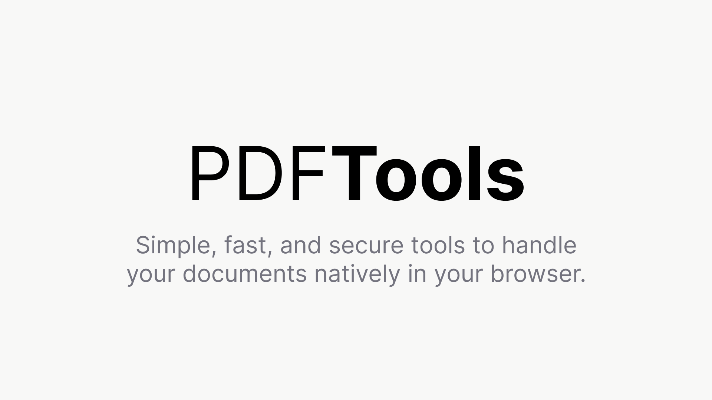

<div align="center">
  

  <h1>PDF Tool</h1>
  <p><strong>Fast, privacy-first PDF utilities in the browser.</strong></p>
  <p>
    Live Demo: <a href="https://pdf.nimaaksoy.com">pdf.nimaaksoy.com</a><br />
    Sponsored by: <a href="https://bowora.com">Bowora</a>
  </p>
</div>

## Overview
PDF Tool is a modern web app for common PDF workflows with a focus on speed, simplicity, and local-first processing.

The current production-ready feature is **PDF Merge**:
- Upload multiple PDF files
- Reorder files with drag-and-drop
- See first-page previews
- Download one merged PDF

## Why This Project
- **Privacy-first:** Files are processed in the browser during merge flows.
- **Simple UX:** Minimal interface, fast interactions, no complex setup for users.
- **Extensible base:** Built to grow into a full PDF toolkit (split, convert, protect, etc.).
- **Community-friendly:** Free to use and open for contributions.

## Current Feature Set
### PDF Merge
- Multi-file upload (`.pdf`)
- Drag-and-drop sorting
- Thumbnail preview generation for the first page
- One-click merged export (`combined.pdf`)

## Tech Stack
- **Frontend:** React 19 + TypeScript + Vite
- **Styling/UI:** Tailwind CSS v4, Motion, Lucide icons
- **PDF:** `pdf-lib` (merge), `pdfjs-dist` (preview rendering)
- **Interactions:** `@dnd-kit` for sortable drag-and-drop lists

## Getting Started
### Prerequisites
- Node.js 18+ (recommended latest LTS)
- npm

### Install
```bash
npm install
```

### Run Dev Server
```bash
npm run dev
```

Default local URL:
- `http://localhost:3000/`

### Build for Production
```bash
npm run build
```

### Type Check
```bash
npm run lint
```

## Available Scripts
- `npm run dev` - Start Vite development server
- `npm run build` - Create production build in `dist/`
- `npm run preview` - Preview the production build
- `npm run lint` - Run TypeScript type-check (`tsc --noEmit`)
- `npm run clean` - Remove build artifacts

## Project Structure
```text
src/
  components/
    PDFPreview.tsx
  utils/
    pdf.ts
  App.tsx
  main.tsx
```

## Deployment Notes
- Vite base path defaults to `/` (root-domain hosting) in [`vite.config.ts`](./vite.config.ts).
- To deploy under a subpath, set `VITE_BASE_PATH` (example: `/pdfmerge/`) before building.

## Live Demo
- Production: [https://pdf.nimaaksoy.com](https://pdf.nimaaksoy.com)

## Environment Variables
Current merge workflow does not require runtime secrets.

`.env.example` includes keys from the original AI Studio template (`GEMINI_API_KEY`, `APP_URL`) for future server/API integrations.

## Privacy
For current merge functionality, PDF processing happens client-side in the browser.

If future features introduce server-side workflows, this section should be updated with exact data handling behavior.

## Roadmap
- PDF to Image
- Split PDF
- Password protect PDF
- Additional compression and optimization tools

## Contributing
Issues and pull requests are welcome.

If you plan major changes, open an issue first to discuss scope and design.

## Support
If this project helps you, you can support ongoing development:

- Buy Me a Coffee: [https://buymeacoffee.com/nimaa](https://buymeacoffee.com/nimaa)

## License
This project is licensed under the Apache License 2.0. See [LICENSE](./LICENSE).

The sponsor attribution is included in [NOTICE](./NOTICE). If you redistribute this project
or derivative works, keep the `NOTICE` file as required by Apache-2.0.
